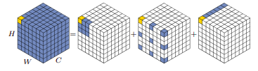
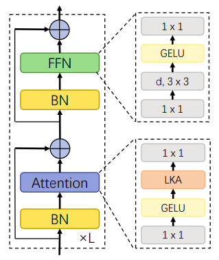
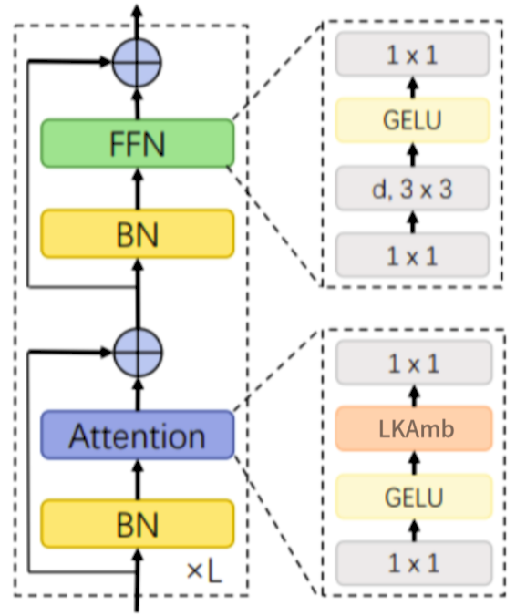
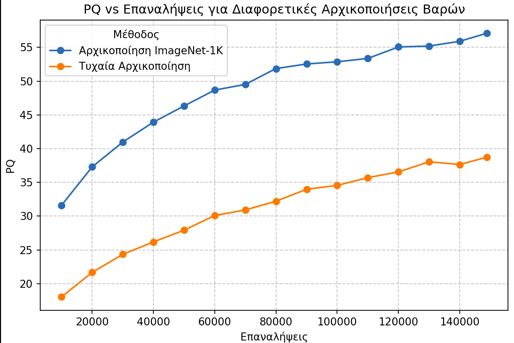
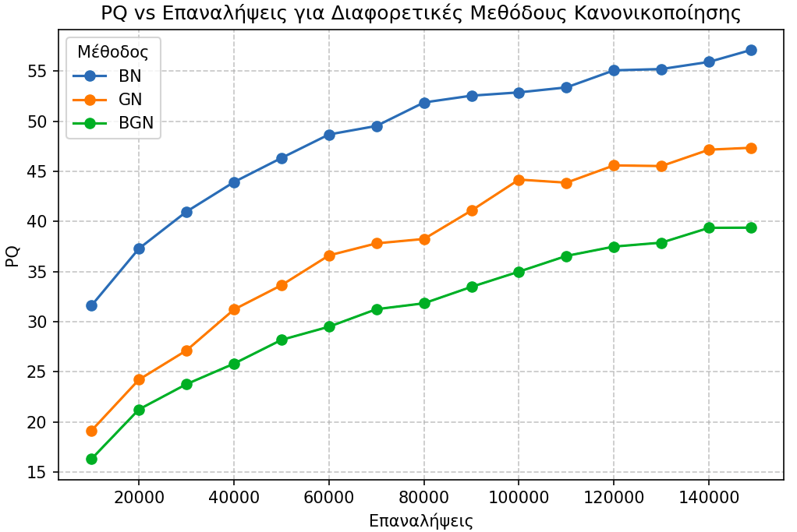
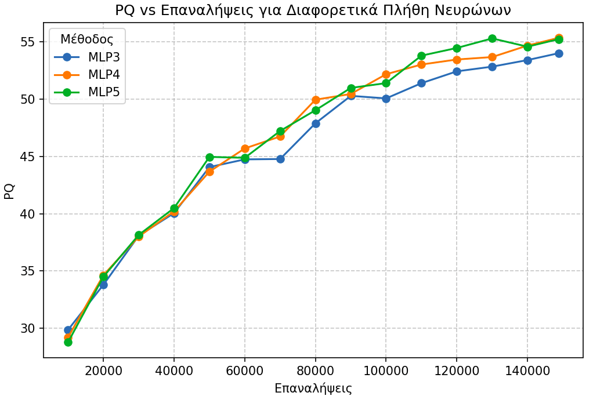
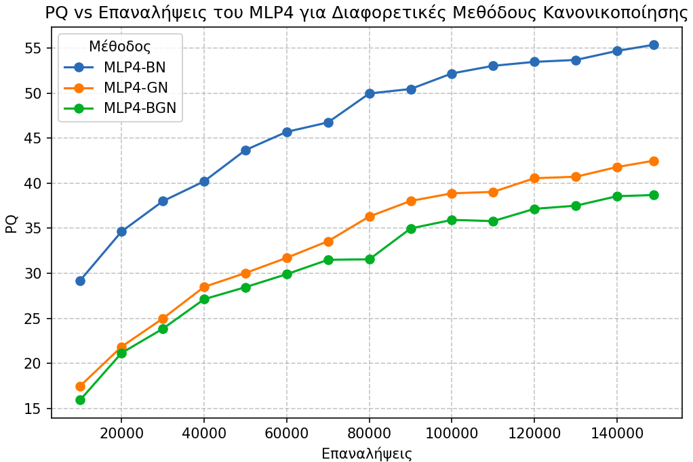
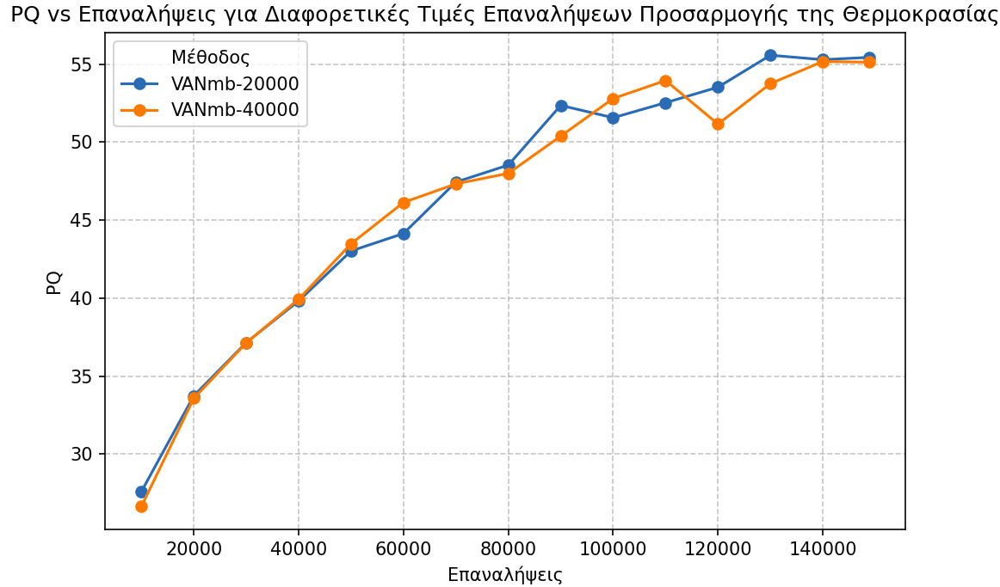
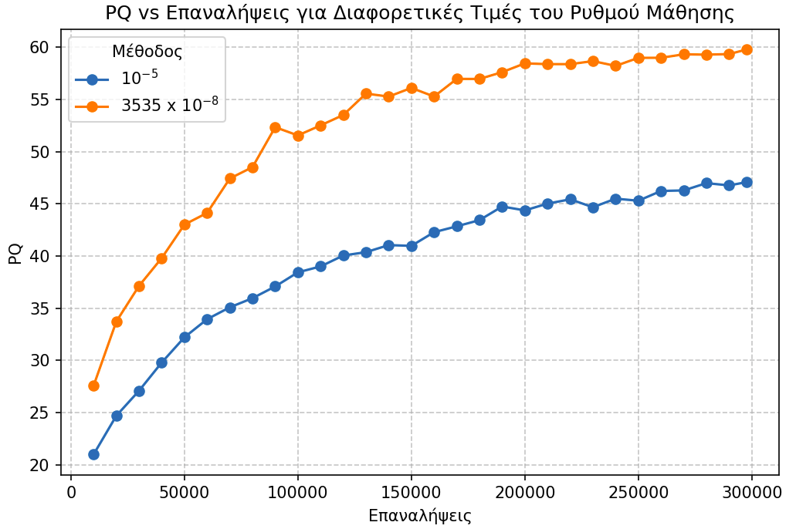

## Contribution of This Work

This work is based on the Visual Attention Network (VAN) feature extractor. For this reason, the VAN architecture and its core components are first presented in detail to clarify its operation. Next, the modifications implemented in this work are described, leading to the proposed Visual Attention Network multi-branch model.

 

### Visual Attention Network

The Visual Attention Network (VAN) is a feature extractor designed to combine the strengths of convolutional neural networks and self-attention mechanisms while avoiding their main drawbacks. VAN is built around a self-attention mechanism called Large Kernel Attention (LKA). Although self-attention was originally introduced for natural language processing, it was later widely adopted in computer-vision tasks. However, due to the two-dimensional nature of images, applying self-attention to visual data introduces several challenges:

 

- Treating images as one-dimensional sequences ignores their inherent 2D structure.

- The computational complexity $O(n^2)$ of standard self-attention is too high for high-resolution images.

- Conventional self-attention primarily models spatial interactions between pixels and often underrepresents interactions across channels. In many cases, different channels correspond to different objects or semantic information.

 

Large Kernel Attention aims to address these issues. LKA is a core component of VAN and, while it is an attention mechanism, it does not inherit the same limitations. The key idea is to use large-kernel convolutions, enabling the model to capture relationships between distant pixels. However, large-kernel convolutions are computationally expensive and require a large number of parameters. To mitigate this, LKA adopts a decomposed convolution form that significantly reduces computational cost.

Specifically, a large-kernel convolution is decomposed into three parts: a small spatial convolution for capturing local correlations, a dilated spatial convolution for capturing long-range dependencies, and a pointwise convolution for capturing channel interactions.

In the original implementation, a `K × K` convolution is decomposed into:

 

- a `⌈K/d⌉ × ⌈K/d⌉` spatial convolution with dilation factor `d` spatial convolution with dilation factor `d`,

- a `(2d − 1) × (2d − 1)` spatial convolution, and

- a pointwise convolution.

 

This decomposition makes it possible to capture long-range pixel correlations without a substantial increase in computational complexity or model parameters.

 
 

  
   
  <em>Figure 1: Decomposition of a large-kernel convolution for K = 7 and d = 2.</em>

 
 

The LKA mechanism can be expressed as:

 

$$
\text{Attention}(F)=\text{Conv}_{1\times 1}\!\left(\text{DW-D-Conv}\!\left(\text{DW-Conv}(F)\right)\right)
$$

 

$$
\text{Output}(F)=\text{Attention}(F)\otimes F
$$

 

where F ∈ RC×H×W is the feature map and Attention ∈ RC&times;H&times;W is the attention map. Each value in the attention map represents the importance of the corresponding feature. The operator `⊗` denotes element-wise multiplication.

VAN consists of four sequential stages. Let the input image have dimensions `H × W × C`. Before each stage, the input resolution is reduced using strided convolutions. The spatial resolution changes as follows:
 

- Stage 1: `H/4 × W/4`

- Stage 2: `H/8 × W/8`

- Stage 3: `H/16 × W/16`

- Stage 4: `H/32 × W/32`

 

VAN is available in seven variants. The number of channels `C` in each stage depends on the chosen variant. For example, in VAN-B0 the channel dimensions are:

 

- Stage 1: `C = 32`

- Stage 2: `C = 64`

- Stage 3: `C = 160`

- Stage 4: `C = 256`

 

Within each stage, both the spatial resolution and channel dimension remain constant. Each stage consists of a sequence of `L` identical layers. The value of `L` depends on the stage and the selected VAN variant. For VAN-B0, `L = 3` for stages 1 and 2, `L = 5` for stage 3, and `L = 2` for stage 4.

 
 

  
   
  <em>Figure 2: Schematic representation of a single VAN stage.</em>

 
 

In the original implementation, the default values are `K = 21` and `d = 3`. This corresponds to a `5 × 5` spatial convolution and a `7 × 7` dilated spatial convolution with dilation factor 3.

 

### Visual Attention Network multi-branch

The Visual Attention Network multi-branch (VANmb) is a CNN-based feature extractor and an extension of VAN. A key limitation of VAN is that it relies on a single processing path, which restricts its ability to exploit different levels of information simultaneously. VANmb is proposed to address this limitation. Introducing a multi-branch version of the Large Kernel Attention mechanism enables parallel processing of different information views, leading to richer feature representations.

In this work, the LKA mechanism is replaced by the Large Kernel Attention multi-branch mechanism (LKAmb), which consists of three LKA branches:

- Branch 1 uses the original VAN settings `K = 21` and `d = 3`.

- Branch 2 uses `K = 15` and `d = 3`.

- Branch 3 uses `K = 12` and `d = 2`.

 
 

  
   
  <em>Figure 3: Architecture of a single VANmb stage.</em>

 
 

The output of LKAmb is defined as:

 

$$
\text{Output}(LKA_1,LKA_2,LKA_3)=v_1\cdot LKA_1+v_2\cdot LKA_2+v_3\cdot LKA_3
$$

 

The values v1, v2, v3 are weights produced by applying a Softmax normalization over learned parameters. Therefore:

 

$$
v_i \ge 0,\qquad v_1+v_2+v_3=1
$$

 

During the first 20.000 training iterations, a temperature parameter is incorporated into the Softmax. The temperature is initialized at five and decays exponentially to one. The temperature at each iteration is computed as:

 

$$
T(\text{step}) = T_{\text{end}} + \left(T_{\text{start}} - T_{\text{end}}\right)\exp\!\left(-T_{\text{start}}\cdot \text{progress}\right)
$$

 

$$
\text{progress}=\min\!\left(\frac{\text{step}}{\text{iterations}},\,1.0\right)
$$

 

where `T` is the temperature, `iterations` is the number of iterations required to reach the final temperature, and `step` is the current training iteration. The branch weights are computed as:

 

$$
\text{value}_i(T)=\frac{e^{w_i/T}}{\sum_{j=1}^{3} e^{w_j/T}}, \quad i\in\{1,2,3\}
$$

 

where wi are learnable parameters initialized to 1.

The purpose of the temperature parameter is to ensure that all branches receive sufficient training time and that the model does not collapse into relying on only one branch.

The experimental results for VANmb are presented in Section `Multi-Branch LKA (LKAmb)`.

 

## Experimental Results

To obtain the final model, a large number of experiments were conducted across several variants of VAN. These variants included changes to both the architecture and the parameter initialization, with the goal of examining how each modification affects performance. Through a comparative evaluation of the results, the most effective configurations were identified and subsequently used to shape the final model. Detailed results tables are provided in the Appendix section.

 

### General Setup

All experiments were based on the official Mask2Former codebase, which is built on top of Detectron2. The Mask2Former implementation was modified by replacing the Swin feature extractor with a VAN feature extractor. Experiments were carried out on the Cityscapes validation set, using exclusively the VAN-B0 variant.

 

#### Training Parameters

The original implementation uses 8 GPUs with a batch size of 16. Due to limited computational resources, the present implementation was trained using a single GPU with a batch size of 2. The GPU used was an NVIDIA GeForce RTX 4070.

In the original setup, the learning rate is set to 1e-5 with weight decay equal to 0.05. However, because the batch size was reduced to 2, the learning rate was set to 3535 &times; 10-5 (i.e., 3535 &times; 10-8). The AdamW optimizer was used, and the learning rate schedule followed the Poly policy.

All models were trained on Cityscapes for a total of 148.800 iterations (equivalently, 100 epochs). The only exception was the final model, which was trained for 297.600 iterations (equivalently, 200 epochs). Although the original implementation defines experiments for 90.000 iterations, this setting was not adopted here due to limited computational capacity. For the final model, an additional learning rate value was also evaluated, specifically `1e-5`.

 

### Parameter Initialization

We investigated the impact of using pre-trained weights on model performance. Specifically, we used VAN weights pre-trained on ImageNet-1K for the image classification task over 300 epochs. The goal was to examine whether this initialization provides an advantage over random weight initialization. A graphical comparison in terms of Panoptic Quality (PQ) is shown in the following figure.

 
 

  
   
  <em>Figure 4: Panoptic Quality comparison for different feature-extractor weight initializations.</em>

 
 

Overall, initializing the feature extractor with ImageNet-1K pre-trained weights leads to better results compared to random initialization.

 

#### Results

 

| Model | Initialization | Iterations | PQ | PQth | PQst |
|---|---|---:|---:|---:|---:|
| Mask2Former (VAN-B0) | ImageNet-1K pre-trained | 148.800 | 57.101 | 44.910 | 65.967 |
| Mask2Former (VAN-B0) | Random | 148.800 | 38.726 | 20.307 | 52.122 |

<em>Table 1: Comparison of feature-extractor weight initialization for Mask2Former with a VAN-B0 backbone on Cityscapes. Results are reported in terms of PQ (overall, things, and stuff) after 148,800 training iterations.</em>

 

### Alternative Normalization Methods

As part of the experiments conducted to select the final model, we evaluated configurations where Batch Normalization (BN) was removed and replaced with alternative normalization methods. The normalization methods examined were Group Normalization (GN) and a Batch-and-Group Normalization (BGN) variant.

The motivation for testing different normalization methods arose from the small batch size used in our setup. Due to limited GPU memory, the batch size had to be significantly reduced, which makes Batch Normalization less effective, since it does not perform as well with small batch sizes. For this reason, additional normalization strategies were evaluated.

Since initialization with ImageNet-1K pre-trained weights was found to improve performance, all models in this set of experiments were trained using transfer learning. In this setting, parameters are transferred for all compatible components, while any newly introduced components are initialized randomly.

A graphical comparison of the VAN Panoptic Quality (PQ) across normalization methods is shown in the figure below.

 
 

  
   
  <em>Figure 5: Panoptic Quality comparison for different normalization methods. BN: standard VAN-B0. GN: VAN-B0 variant with Group Normalization. BGN: VAN-B0 variant with Batch-and-Group Normalization.</em>

 
 

It can be observed that Batch Normalization (BN) achieves better results compared to the other two normalization methods.

 

| Model | Initialization | Normalization | Iterations | PQ | PQth | PQst |
|---|---|---|---:|---:|---:|---:|
| Mask2Former (VAN-B0) | ImageNet-1K pre-trained | BN  | 148.800 | 57.101 | 44.910 | 65.967 |
| Mask2Former (VAN-B0) | ImageNet-1K pre-trained | GN  | 148.800 | 47.351 | 30.980 | 59.258 |
| Mask2Former (VAN-B0) | ImageNet-1K pre-trained | BGN | 148.800 | 39.380 | 24.001 | 50.565 |

<em>Table 2: Comparison of VAN-B0 results using different normalization methods.</em>

 

### Replacing the Pointwise Convolution with an MLP

We investigated replacing the pointwise convolution in the LKA module with a two-hidden-layer MLP. In this case, the attention computation takes the following form:

 

$$
\mathrm{Attention}(F)=\mathrm{MLP}(\mathrm{DW\text{-}D\text{-}Conv}(\mathrm{DW\text{-}Conv}(F)))
$$

 

The motivation behind replacing the pointwise convolution with a multi-layer perceptron stems from the linear nature of convolution. Introducing non-linearity may improve the representational capacity of the model.

The number of input and output neurons in the MLP is the same and equals the number of channels in the feature map. To determine the hidden-layer size, we evaluated hidden dimensions equal to 3×, 4×, and 5× the number of feature-map channels. The activation function used was GELU.

A graphical comparison of Panoptic Quality (PQ) for different hidden-layer sizes is shown in the figure below.

 
 

  
   
  <em>Figure 6: Panoptic Quality comparison for different normalization methods.</em>

 
 

All examined VAN variants achieved similar performance; however, the highest Panoptic Quality was obtained with MLP4.

 

| Model | Initialization | Variant | Iterations | PQ | PQth | PQst |
|---|---|---|---:|---:|---:|---:|
| Mask2Former (VAN-B0) | ImageNet-1K pre-trained | MLP3 | 148,800 | 54.022 | 39.707 | 64.432 |
| Mask2Former (VAN-B0) | ImageNet-1K pre-trained | MLP4 | 148,800 | 55.365 | 43.467 | 64.017 |
| Mask2Former (VAN-B0) | ImageNet-1K pre-trained | MLP5 | 148,800 | 55.250 | 43.348 | 63.907 |

<em>Table 3: Panoptic Quality comparison for different numbers of neurons in each MLP hidden layer. MLP3: hidden size = 3× channels. MLP4: 4×. MLP5: 5×.</em>

 

### MLP4 Combined with Alternative Normalization Methods

Next, we evaluated the MLP4 VAN variant in combination with alternative normalization methods. Three normalization strategies were examined: Batch Normalization (BN), Group Normalization (GN), and a Batch-and-Group Normalization (BGN) variant.

A graphical comparison of the Panoptic Quality (PQ) of the MLP4 variant under different normalization methods is shown in Figure 7.

It can be observed that MLP4 with Batch Normalization (MLP4-BN) achieves better results compared to the other two methods.

 

| Model | Initialization | Variant | Normalization | Iterations | PQ | PQth | PQst |
|---|---|---|---|---:|---:|---:|---:|
| Mask2Former (VAN-B0) | ImageNet-1K pre-trained | MLP4 | BN  | 148.800 | 55.365 | 43.467 | 64.017 |
| Mask2Former (VAN-B0) | ImageNet-1K pre-trained | MLP4 | GN  | 148.800 | 42.495 | 24.658 | 55.467 |
| Mask2Former (VAN-B0) | ImageNet-1K pre-trained | MLP4 | BGN | 148.800 | 38.686 | 21.997 | 50.823 |

<em>Table 4: Panoptic Quality comparison for the MLP4 VAN variant under different normalization methods (BN, GN, and BGN) after 148,800 training iterations.</em>

 
 

  
   
  <em>Figure 7: Panoptic Quality comparison of the MLP4 VAN variant under different normalization methods. MLP4-BN: Batch Normalization. MLP4-GN: Group Normalization. MLP4-BGN: Batch-and-Group Normalization.</em>

 
 

### Multi-Branch LKA (LKAmb)

We investigated replacing the LKA mechanism of the Visual Attention Network (VAN) with the multi-branch LKAmb mechanism. This modification results in the VANmb model described in Section `Visual Attention Network multi-branch`. To optimize the model parameters, we evaluated two different values for the total number of temperature-adjustment iterations, namely 20.000 and 40.000.

A graphical comparison of Panoptic Quality (PQ) for different temperature-adjustment iteration counts is shown in Figure 8.

It can be observed that VANmb with 20.000 temperature-adjustment iterations achieves better results than the alternative configuration.

 

| Model | Initialization | Temp-adjustment iterations | Training iterations | PQ | PQth | PQst |
|---|---|---:|---:|---:|---:|---:|
| Mask2Former (VANmb-B0) | ImageNet-1K pre-trained | 20,000 | 148,800 | 55.436 | 43.282 | 64.322 |
| Mask2Former (VANmb-B0) | ImageNet-1K pre-trained | 40,000 | 148,800 | 55.123 | 41.681 | 64.898 |

<em>Table 5: Panoptic Quality comparison for different total numbers of temperature-adjustment iterations. VAN-20000: 20,000 iterations. VAN-40000: 40,000 iterations.</em>

 
 

  
   
  <em>Figure 8: Panoptic Quality comparison for different total numbers of temperature-adjustment iterations. VAN-20000: 20.000 iterations. VAN-40000: 40.000 iterations.</em>

---

 
 

### Learning Rate Evaluation for VANmb-20000

Next, we evaluated VANmb-20000 using an alternative learning rate, specifically `1e-5`. Figure 9 shows a comparison of the Panoptic Quality (PQ) of Mask2Former with the VANmb-20000 backbone for different learning-rate values.

 

#### Results (297.600 training iterations)

**Run A**  
Model: Mask2Former (VANmb-20000)  
Initialization: ImageNet-1K pre-trained  
Learning rate: `1e-5`

 

| Split | PQ | SQ | RQ |
|---|---:|---:|---:|
| All | 47.085 | 78.559 | 58.510 |
| Things | 27.782 | 77.410 | 35.986 |
| Stuff | 61.123 | 79.394 | 74.891 |

<em>Table 6: Final evaluation of Mask2Former with a VANmb-20000 backbone after 297,600 training iterations (Run A, learning rate <code>1e-5</code>). Results are reported for the All, Things, and Stuff splits in terms of PQ, SQ, and RQ.</em>

 

**Run B**  
Model: Mask2Former (VANmb-20000)  
Initialization: ImageNet-1K pre-trained  
Learning rate: `3535e-5` (i.e., 3535 &times; 10-8)

 

| Split | PQ | SQ | RQ |
|---|---:|---:|---:|
| All | 59.795 | 80.468 | 73.093 |
| Things | 49.835 | 78.936 | 62.602 |
| Stuff | 67.039 | 81.583 | 80.722 |

<em>Table 7: Final evaluation of Mask2Former with a VANmb-20000 backbone after 297,600 training iterations (Run B, learning rate 3535 &times; 10-8). Results are reported for the All, Things, and Stuff splits in terms of PQ, SQ, and RQ.</em>

 

Overall, setting the learning rate to `3535e-5` (i.e., 3535 &times; 10-8) results in better performance compared to `1e-5`.

 
 

  
   
  <em>Figure 9: Panoptic Quality comparison for different learning-rate values using the VANmb-20000 backbone.</em>

 
 

## Conclusions and Future Work

In conclusion, the experimental results highlight the potential of modern architectures for panoptic image segmentation. Modifying the VAN backbone by extending it with additional components helped identify the most effective techniques, which were then used to introduce the new modified backbone VANmb.

The VANmb-B0 backbone, combined with the Mask2Former panoptic head, achieved Panoptic Quality (PQ) = 59.795 on the Cityscapes validation set. Although this is a notable result, it does not reach the performance of state-of-the-art models. Table 8 summarizes the Mask2Former performance for different backbones.

 

| Model | Backbone | PQ |
|---|---|---:|
| Mask2Former | R50 | 62.1 |
| Mask2Former | Swin-B  | 66.1 |
| Mask2Former | Swin-L | 66.6 |

<em>Table 8: Panoptic Quality (PQ) of Mask2Former on the Cityscapes validation set for different backbone architectures.</em>

 

Despite not matching these performance levels, this outcome was expected: the backbones listed above have substantially more parameters and were developed by large research teams with access to significantly greater computational resources. The relatively small parameter count of VANmb-B0 can still be an advantage, as it does not require high-end hardware and can be deployed on low-power devices (e.g., portable devices and small unmanned vehicles). In addition, the lower model complexity makes it an attractive option for real-time applications.

 

### Future Work

The proposed model offers substantial room for improvement. Future work may explore directions related to both the architecture and the training procedure, including:

- Evaluate VANmb on additional vision tasks (e.g., pose estimation, image classification, semantic segmentation).

- Combine VANmb with alternative panoptic segmentation heads and benchmark on additional datasets (e.g., COCO, ADE20K).

- Explore additional LKAmb configurations (e.g., different numbers of branches, kernel sizes, and temperature-adjustment schedules).

- Investigate transfer of the VANmb backbone to other domains (e.g., NLP and speech/audio processing).

- Study multi-scale LKAmb designs where each branch uses multiple kernel sizes.

- Pre-train all VANmb components end-to-end (rather than partial initialization), using datasets such as ImageNet.

- Evaluate additional VANmb variants that could not be explored due to limited computational resources.

 

## Appendix

This appendix provides a detailed summary of the experimental results reported in this work. Evaluation was performed using the following metrics: PQ, PQth, PQst, SQ, SQth, SQst, RQ, RQth, and RQst. Metrics were recorded every 10.000 iterations. All experiments were conducted using the Mask2Former panoptic head.

 

### A. Parameter Initialization

Table 9 reports the experimental results obtained using the VAN-B0 backbone with **random weight initialization**. (The corresponding table for **ImageNet-1K pre-trained** initialization is provided separately in table 10.)

 

#### Results: VAN-B0 with Random Initialization 

 

| Iterations | PQ | PQth | PQst | SQ | SQth | SQst | RQ | RQth | RQst |
|---:|---:|---:|---:|---:|---:|---:|---:|---:|---:|
| 10k | 18.032 | 1.311 | 30.193 | 40.395 | 23.521 | 52.668 | 22.723 | 1.952 | 37.829 |
| 20k | 21.664 | 3.200 | 35.093 | 54.158 | 30.858 | 71.104 | 27.069 | 4.663 | 43.365 |
| 30k | 24.341 | 4.967 | 38.432 | 55.503 | 31.862 | 72.696 | 30.419 | 7.184 | 47.317 |
| 40k | 26.180 | 6.141 | 40.753 | 56.550 | 33.068 | 73.627 | 32.664 | 8.721 | 50.077 |
| 50k | 27.919 | 7.764 | 42.577 | 56.696 | 33.237 | 73.758 | 35.049 | 11.099 | 52.467 |
| 60k | 30.096 | 9.470 | 45.096 | 61.151 | 42.357 | 74.819 | 37.830 | 13.327 | 55.651 |
| 70k | 30.920 | 10.138 | 46.033 | 61.215 | 42.270 | 74.994 | 38.729 | 14.147 | 56.606 |
| 80k | 32.213 | 10.866 | 47.738 | 70.090 | 63.191 | 75.108 | 40.579 | 15.142 | 59.080 |
| 90k | 33.981 | 14.043 | 48.482 | 70.740 | 64.488 | 75.288 | 42.903 | 19.201 | 60.141 |
| 100k | 34.560 | 15.724 | 48.260 | 70.075 | 62.833 | 75.342 | 43.620 | 21.452 | 59.743 |
| 110k | 35.707 | 14.655 | 51.018 | 71.075 | 63.870 | 76.316 | 44.981 | 20.071 | 63.097 |
| 120k | 36.559 | 17.335 | 50.541 | 71.202 | 64.616 | 75.992 | 46.091 | 23.416 | 62.582 |
| 130k | 38.058 | 19.563 | 51.509 | 72.245 | 74.041 | 76.120 | 48.025 | 26.310 | 63.818 |
| 140k | 37.658 | 18.005 | 51.952 | 71.643 | 65.122 | 76.386 | 47.412 | 24.224 | 64.275 |
| 148800 | 38.726 | 20.307 | 52.122 | 71.522 | 64.964 | 76.292 | 48.726 | 27.015 | 64.516 |

<em>Table 9: Training progress of Mask2Former with a VAN-B0 backbone using random weight initialization. Results are reported at different training iterations for PQ, SQ, and RQ (overall and split into “things” and “stuff”).</em>

 

#### Results: VAN-B0 with ImageNet-1K Pre-trained Weights 

 

| Iterations | PQ | PQth | PQst | SQ | SQth | SQst | RQ | RQth | RQst |
|---:|---:|---:|---:|---:|---:|---:|---:|---:|---:|
| 10k | 31.605 | 5.653 | 50.478 | 54.521 | 33.447 | 69.848 | 39.543 | 8.053 | 62.445 |
| 20k | 37.295 | 10.728 | 56.617 | 64.412 | 45.369 | 78.261 | 46.481 | 14.695 | 69.598 |
| 30k | 40.977 | 15.855 | 59.247 | 69.304 | 56.251 | 78.798 | 51.061 | 21.234 | 72.754 |
| 40k | 43.928 | 20.937 | 60.648 | 78.155 | 76.751 | 79.176 | 54.719 | 27.811 | 74.289 |
| 50k | 46.333 | 24.865 | 61.947 | 74.494 | 67.515 | 79.570 | 57.483 | 32.276 | 75.814 |
| 60k | 48.678 | 28.734 | 63.182 | 79.458 | 78.403 | 80.226 | 59.970 | 36.670 | 76.915 |
| 70k | 49.528 | 30.716 | 63.209 | 79.039 | 77.453 | 80.192 | 61.401 | 39.919 | 77.024 |
| 80k | 51.870 | 35.158 | 64.024 | 79.633 | 78.591 | 80.390 | 63.824 | 44.455 | 77.911 |
| 90k | 52.549 | 35.280 | 65.108 | 79.482 | 77.584 | 80.862 | 64.821 | 45.374 | 78.963 |
| 100k | 52.877 | 36.745 | 64.609 | 79.481 | 77.906 | 80.627 | 65.222 | 47.033 | 78.450 |
| 110k | 53.375 | 38.845 | 63.942 | 79.814 | 78.510 | 80.762 | 65.629 | 49.384 | 77.443 |
| 120k | 55.076 | 41.693 | 64.810 | 80.036 | 78.838 | 80.908 | 67.595 | 52.627 | 78.480 |
| 130k | 55.206 | 40.564 | 65.854 | 80.089 | 78.859 | 80.983 | 67.678 | 51.075 | 79.754 |
| 140k | 55.917 | 42.707 | 65.525 | 80.065 | 79.007 | 80.834 | 68.640 | 53.698 | 79.507 |
| 148800 | 57.101 | 44.910 | 65.967 | 80.203 | 79.171 | 80.954 | 69.995 | 56.295 | 79.959 |

---

<em>Table 10: Training progress of Mask2Former with a VAN-B0 backbone initialized with ImageNet-1K pre-trained weights. Results are reported at different training iterations for PQ, SQ, and RQ (overall and split into “things” and “stuff”).</em>

 

### B. Alternative Normalization Methods

Table 11 reports the results obtained using VAN-B0 where **Batch Normalization** was replaced by **Group Normalization (GN)**. (The corresponding results for replacing BN with **Batch-and-Group Normalization (BGN)** are provided separately in table 12.)

All models in this subsection use **ImageNet-1K pre-trained weights**; however, these weights are not fully compatible, as they were produced by training the standard VAN-B0 model.

 

#### Results: VAN-B0 with Group Normalization

 

| Iterations | PQ | PQth | PQst | SQ | SQth | SQst | RQ | RQth | RQst |
|---:|---:|---:|---:|---:|---:|---:|---:|---:|---:|
| 10k | 19.128 | 1.723 | 31.787 | 37.187 | 15.731 | 52.792 | 23.924 | 2.486 | 39.514 |
| 20k | 24.220 | 4.717 | 38.404 | 56.313 | 33.910 | 72.607 | 30.136 | 6.623 | 47.237 |
| 30k | 27.131 | 6.824 | 41.900 | 57.489 | 34.263 | 74.381 | 33.940 | 9.449 | 51.751 |
| 40k | 31.212 | 10.057 | 46.597 | 61.732 | 42.674 | 75.592 | 39.281 | 13.974 | 57.686 |
| 50k | 33.639 | 13.234 | 48.479 | 66.692 | 53.894 | 75.999 | 42.270 | 18.005 | 59.917 |
| 60k | 36.611 | 15.450 | 52.002 | 70.902 | 63.669 | 76.163 | 46.233 | 21.090 | 64.518 |
| 70k | 37.814 | 15.906 | 53.747 | 71.922 | 64.987 | 76.965 | 47.679 | 21.709 | 66.566 |
| 80k | 38.252 | 15.808 | 54.576 | 72.553 | 65.839 | 77.436 | 48.055 | 21.484 | 67.380 |
| 90k | 41.089 | 20.307 | 56.204 | 73.467 | 67.127 | 78.079 | 51.425 | 26.910 | 69.254 |
| 100k | 44.176 | 27.705 | 56.155 | 77.291 | 76.216 | 78.074 | 55.231 | 36.245 | 69.038 |
| 110k | 43.870 | 25.205 | 57.444 | 73.202 | 66.366 | 78.173 | 54.905 | 33.129 | 70.742 |
| 120k | 45.593 | 28.297 | 58.172 | 77.969 | 77.363 | 78.410 | 56.923 | 36.642 | 71.673 |
| 130k | 45.527 | 27.664 | 58.517 | 76.946 | 74.287 | 78.881 | 56.929 | 36.495 | 71.791 |
| 140k | 47.159 | 30.533 | 59.250 | 78.221 | 77.245 | 78.931 | 58.791 | 39.543 | 72.789 |
| 148800 | 47.351 | 30.980 | 59.258 | 78.292 | 77.412 | 78.932 | 58.995 | 40.013 | 72.800 |

<em>Table 11: Mask2Former with a VAN-B0 backbone where Batch Normalization is replaced by Group Normalization (GN). Results are reported across training iterations for PQ, SQ, and RQ (overall, things, and stuff).</em>

 

#### Results: VAN-B0 with Batch-and-Group Normalization (`tab:BatchGroup`)

 

| Iterations | PQ | PQth | PQst | SQ | SQth | SQst | RQ | RQth | RQst |
|---:|---:|---:|---:|---:|---:|---:|---:|---:|---:|
| 10k | 16.301 | 1.439 | 27.110 | 36.772 | 15.982 | 51.891 | 20.817 | 2.060 | 34.458 |
| 20k | 21.250 | 3.811 | 33.932 | 54.059 | 31.748 | 70.286 | 26.884 | 5.484 | 42.448 |
| 30k | 23.765 | 5.090 | 37.347 | 56.045 | 32.846 | 72.916 | 29.805 | 7.195 | 46.248 |
| 40k | 25.811 | 7.666 | 39.007 | 56.662 | 33.392 | 73.586 | 32.399 | 10.865 | 48.059 |
| 50k | 28.184 | 8.800 | 42.281 | 60.154 | 41.283 | 73.879 | 35.383 | 12.581 | 51.966 |
| 60k | 29.496 | 10.337 | 43.430 | 64.893 | 52.003 | 74.268 | 37.245 | 14.724 | 53.624 |
| 70k | 31.246 | 11.869 | 45.339 | 65.239 | 52.390 | 74.584 | 39.495 | 16.568 | 56.169 |
| 80k | 31.833 | 12.811 | 45.667 | 65.937 | 54.109 | 74.540 | 40.201 | 17.581 | 56.652 |
| 90k | 33.474 | 14.112 | 47.557 | 70.652 | 63.913 | 75.553 | 42.230 | 19.345 | 58.874 |
| 100k | 34.992 | 17.321 | 47.844 | 70.336 | 63.238 | 75.499 | 44.363 | 23.738 | 59.362 |
| 110k | 36.562 | 19.751 | 48.788 | 75.859 | 74.916 | 76.545 | 46.045 | 26.788 | 60.051 |
| 120k | 37.492 | 20.809 | 49.625 | 74.674 | 72.905 | 75.960 | 47.471 | 28.315 | 61.402 |
| 130k | 37.886 | 22.271 | 49.242 | 75.435 | 74.267 | 76.285 | 47.705 | 29.727 | 60.779 |
| 140k | 39.363 | 24.010 | 50.530 | 75.893 | 75.259 | 76.354 | 49.515 | 31.666 | 62.496 |
| 148800 | 39.380 | 24.001 | 50.565 | 75.692 | 74.797 | 76.343 | 49.678 | 32.019 | 62.521 |

<em>Table 12: Mask2Former with a VAN-B0 backbone where Batch Normalization is replaced by Batch-and-Group Normalization (BGN). Results are reported across training iterations for PQ, SQ, and RQ (overall, things, and stuff). ImageNet-1K pre-trained weights are used, but they are not fully compatible because they originate from training the standard VAN-B0 model.</em>

> Notes: BN was replaced with **Batch-and-Group Normalization (BGN)**. Parameters were initialized using **ImageNet-1K pre-trained weights**; however, these weights are not fully compatible because they originate from training the standard VAN-B0 model.

---

 

### C. Replacing the Pointwise Convolution with an MLP

This subsection reports experimental results obtained by replacing the pointwise convolution in the LKA module with a multi-layer perceptron (MLP). Different hidden-layer sizes were evaluated. Results are reported in Tables 13, 14, and 15.

All models in this subsection use **ImageNet-1K pre-trained weights**; however, these weights are not fully compatible because they originate from training the standard VAN-B0 model.

 

#### Results: VAN-B0 with MLP (Hidden size = 3× channels) 

 

| Iterations | PQ | PQth | PQst | SQ | SQth | SQst | RQ | RQth | RQst |
|---:|---:|---:|---:|---:|---:|---:|---:|---:|---:|
| 10k | 29.863 | 6.086 | 47.155 | 56.993 | 33.488 | 74.087 | 37.885 | 8.799 | 59.039 |
| 20k | 33.800 | 10.210 | 50.956 | 63.397 | 44.206 | 77.354 | 42.204 | 14.339 | 62.469 |
| 30k | 38.090 | 12.621 | 56.613 | 63.927 | 44.139 | 78.318 | 47.553 | 17.346 | 69.521 |
| 40k | 40.060 | 15.753 | 57.738 | 73.869 | 67.029 | 78.843 | 49.958 | 21.307 | 70.795 |
| 50k | 44.079 | 22.774 | 59.574 | 74.054 | 66.855 | 79.290 | 54.662 | 29.669 | 72.838 |
| 60k | 44.751 | 22.481 | 60.946 | 74.507 | 67.808 | 79.379 | 55.570 | 29.480 | 74.545 |
| 70k | 44.781 | 22.268 | 61.154 | 74.639 | 67.743 | 79.654 | 55.621 | 29.319 | 74.750 |
| 80k | 47.903 | 28.369 | 62.109 | 74.769 | 67.729 | 79.888 | 59.188 | 36.455 | 75.721 |
| 90k | 50.297 | 33.422 | 62.570 | 78.891 | 77.141 | 80.163 | 62.240 | 43.179 | 76.102 |
| 100k | 50.076 | 32.838 | 62.612 | 77.986 | 75.102 | 80.084 | 62.075 | 42.635 | 76.214 |
| 110k | 51.407 | 35.164 | 63.220 | 78.627 | 76.420 | 80.233 | 63.835 | 45.893 | 76.885 |
| 120k | 52.439 | 36.892 | 63.746 | 79.561 | 78.435 | 80.380 | 64.678 | 47.019 | 77.520 |
| 130k | 52.849 | 37.715 | 63.856 | 79.304 | 77.502 | 80.614 | 65.148 | 48.328 | 77.381 |
| 140k | 53.423 | 38.795 | 64.061 | 79.371 | 77.747 | 80.551 | 65.923 | 49.690 | 77.728 |
| 148800 | 54.022 | 39.707 | 64.432 | 79.272 | 77.439 | 80.604 | 66.777 | 51.080 | 78.193 |

<em>Table 13: Mask2Former with a VAN-B0 backbone where the LKA pointwise convolution is replaced by an MLP with hidden size 3× the channel dimension. Results are reported across training iterations for PQ, SQ, and RQ (overall, things, and stuff). ImageNet-1K pre-trained weights are used, but they are not fully compatible because they originate from training the standard VAN-B0 model.</em>

> Notes: Pointwise convolution in LKA was replaced with an MLP. Each hidden layer has **3×** the number of feature-map channels. Parameters were initialized using **ImageNet-1K pre-trained weights** (not fully compatible, as they originate from training the standard VAN-B0 model).

---

 

#### Results: VAN-B0 with MLP (Hidden size = 4× channels) 

 

| Iterations | PQ | PQth | PQst | SQ | SQth | SQst | RQ | RQth | RQst |
|---:|---:|---:|---:|---:|---:|---:|---:|---:|---:|
| 10k | 29.215 | 4.478 | 47.206 | 58.089 | 33.257 | 76.148 | 36.659 | 6.508 | 58.588 |
| 20k | 34.636 | 10.691 | 52.050 | 62.956 | 43.747 | 76.926 | 43.709 | 15.057 | 64.547 |
| 30k | 38.009 | 14.017 | 55.457 | 63.841 | 44.554 | 77.868 | 47.792 | 19.406 | 68.436 |
| 40k | 40.211 | 16.270 | 57.622 | 68.940 | 56.322 | 78.118 | 50.498 | 21.989 | 71.232 |
| 50k | 43.680 | 21.512 | 59.803 | 73.892 | 66.794 | 79.055 | 54.492 | 28.451 | 73.432 |
| 60k | 45.705 | 25.494 | 60.404 | 74.677 | 68.315 | 79.305 | 56.641 | 32.843 | 73.949 |
| 70k | 46.752 | 27.601 | 60.679 | 74.328 | 67.400 | 79.367 | 58.186 | 35.811 | 74.458 |
| 80k | 49.964 | 33.304 | 62.081 | 78.128 | 75.867 | 79.773 | 62.122 | 43.310 | 75.804 |
| 90k | 50.461 | 32.998 | 63.162 | 79.063 | 77.117 | 80.478 | 62.291 | 42.570 | 76.634 |
| 100k | 52.189 | 38.024 | 62.491 | 78.444 | 76.250 | 80.039 | 64.653 | 48.893 | 75.115 |
| 110k | 53.035 | 39.238 | 63.068 | 79.248 | 77.745 | 80.340 | 65.508 | 50.162 | 76.668 |
| 120k | 53.473 | 39.298 | 63.782 | 79.272 | 77.651 | 80.451 | 66.026 | 50.230 | 77.514 |
| 130k | 53.686 | 39.957 | 63.671 | 79.360 | 77.512 | 80.704 | 66.195 | 51.106 | 77.169 |
| 140k | 54.690 | 42.304 | 63.697 | 79.396 | 77.665 | 80.656 | 67.474 | 53.948 | 77.312 |
| 148800 | 55.365 | 43.467 | 64.017 | 79.714 | 78.269 | 80.764 | 68.114 | 55.070 | 77.599 |

<em>Table 14: Mask2Former with a VAN-B0 backbone where the LKA pointwise convolution is replaced by an MLP with hidden size 4× the channel dimension. Results are reported across training iterations for PQ, SQ, and RQ (overall, things, and stuff). ImageNet-1K pre-trained weights are used, but they are not fully compatible because they originate from training the standard VAN-B0 model.</em>

> Notes: Pointwise convolution in LKA was replaced with an MLP. Each hidden layer has **4×** the number of feature-map channels. Parameters were initialized using **ImageNet-1K pre-trained weights** (not fully compatible, as they originate from training the standard VAN-B0 model).

 

#### Results: VAN-B0 with MLP (Hidden size = 5× channels) 

 

| Iterations | PQ | PQth | PQst | SQ | SQth | SQst | RQ | RQth | RQst |
|---:|---:|---:|---:|---:|---:|---:|---:|---:|---:|
| 10k | 28.783 | 5.297 | 45.863 | 57.333 | 33.161 | 74.913 | 36.071 | 7.689 | 56.713 |
| 20k | 34.502 | 10.206 | 52.172 | 63.207 | 44.112 | 77.093 | 43.291 | 14.422 | 64.288 |
| 30k | 38.152 | 12.847 | 56.556 | 63.767 | 43.929 | 78.195 | 47.835 | 17.809 | 69.672 |
| 40k | 40.500 | 16.500 | 57.956 | 68.952 | 55.927 | 78.425 | 50.717 | 22.250 | 71.421 |
| 50k | 44.968 | 24.422 | 59.911 | 74.284 | 67.461 | 79.247 | 55.861 | 31.949 | 73.252 |
| 60k | 44.886 | 24.320 | 59.844 | 74.311 | 67.537 | 79.237 | 55.690 | 31.528 | 73.262 |
| 70k | 47.229 | 28.727 | 60.685 | 77.861 | 75.685 | 79.444 | 58.672 | 37.413 | 74.133 |
| 80k | 49.045 | 31.326 | 61.931 | 74.283 | 66.604 | 79.868 | 60.856 | 40.606 | 75.583 |
| 90k | 50.992 | 35.332 | 62.381 | 78.787 | 76.905 | 80.156 | 62.964 | 45.200 | 75.884 |
| 100k | 51.409 | 35.671 | 62.855 | 78.742 | 76.933 | 80.057 | 63.477 | 45.319 | 76.684 |
| 110k | 53.810 | 40.164 | 63.735 | 79.168 | 77.508 | 80.376 | 66.480 | 51.348 | 77.486 |
| 120k | 54.479 | 41.072 | 64.230 | 79.536 | 78.098 | 80.582 | 67.043 | 52.042 | 77.954 |
| 130k | 55.314 | 43.731 | 63.739 | 79.463 | 78.043 | 80.496 | 68.128 | 55.464 | 77.337 |
| 140k | 54.591 | 41.891 | 63.827 | 79.666 | 78.410 | 80.579 | 67.106 | 52.960 | 77.393 |
| 148800 | 55.250 | 43.348 | 63.907 | 79.539 | 78.307 | 80.435 | 68.014 | 54.781 | 77.639 |

<em>Table 15: Mask2Former with a VAN-B0 backbone where the LKA pointwise convolution is replaced by an MLP with hidden size 5× the channel dimension. Results are reported across training iterations for PQ, SQ, and RQ (overall, things, and stuff). ImageNet-1K pre-trained weights are used, but they are not fully compatible because they originate from training the standard VAN-B0 model.</em>

> Notes: Pointwise convolution in LKA was replaced with an MLP. Each hidden layer has **5×** the number of feature-map channels. Parameters were initialized using **ImageNet-1K pre-trained weights** (not fully compatible, as they originate from training the standard VAN-B0 model).

 

After these experiments, the VAN-B0 variant with an MLP hidden size equal to **4×** the number of feature-map channels achieved the best performance. Therefore, it was further evaluated under different normalization methods. In Table 16, Batch Normalization was replaced with **Group Normalization (GN)**, while in Table 17 it was replaced with **Batch-and-Group Normalization (BGN)**.

 

---

#### Results: VAN-B0 with MLP (Hidden size = 4× channels) + Group Normalization

 

| Iterations | PQ | PQth | PQst | SQ | SQth | SQst | RQ | RQth | RQst |
|---:|---:|---:|---:|---:|---:|---:|---:|---:|---:|
| 10k | 17.495 | 1.669 | 29.005 | 36.617 | 15.696 | 51.831 | 21.869 | 2.437 | 36.002 |
| 20k | 21.852 | 4.257 | 34.648 | 55.722 | 32.727 | 72.446 | 27.184 | 6.028 | 42.570 |
| 30k | 24.983 | 5.349 | 39.261 | 56.378 | 41.434 | 67.247 | 31.059 | 7.603 | 48.119 |
| 40k | 28.493 | 7.958 | 43.427 | 60.006 | 41.485 | 73.475 | 35.759 | 11.215 | 53.610 |
| 50k | 30.031 | 9.721 | 44.802 | 60.692 | 41.692 | 74.510 | 37.754 | 13.595 | 55.324 |
| 60k | 31.725 | 10.457 | 47.192 | 61.869 | 43.457 | 75.260 | 40.116 | 14.634 | 58.649 |
| 70k | 33.570 | 13.057 | 48.488 | 71.852 | 66.280 | 75.903 | 42.264 | 17.742 | 60.099 |
| 80k | 36.308 | 17.377 | 50.076 | 70.996 | 64.015 | 76.073 | 45.768 | 23.493 | 61.968 |
| 90k | 38.035 | 18.776 | 52.041 | 71.773 | 64.631 | 76.967 | 47.754 | 25.123 | 64.213 |
| 100k | 38.881 | 19.451 | 53.013 | 72.056 | 65.313 | 76.960 | 48.976 | 25.907 | 65.753 |
| 110k | 39.043 | 20.581 | 52.470 | 72.408 | 66.050 | 77.032 | 48.844 | 27.110 | 64.651 |
| 120k | 40.559 | 23.684 | 52.832 | 72.411 | 66.271 | 76.876 | 51.008 | 31.247 | 65.380 |
| 130k | 40.719 | 21.960 | 54.361 | 72.572 | 66.265 | 77.159 | 51.195 | 29.043 | 67.304 |
| 140k | 41.802 | 23.685 | 54.979 | 72.528 | 65.729 | 77.472 | 52.516 | 31.315 | 67.936 |
| 148800 | 42.495 | 24.658 | 55.467 | 72.579 | 66.045 | 77.330 | 53.470 | 32.551 | 68.685 |

<em>Table 16: Mask2Former with a VAN-B0 backbone where the LKA pointwise convolution is replaced by an MLP (hidden size 4× channels) and Batch Normalization is replaced by Group Normalization (GN). Results are reported across training iterations for PQ, SQ, and RQ (overall, things, and stuff). ImageNet-1K pre-trained weights are used, but they are not fully compatible because they originate from training the standard VAN-B0 model.</em>

> Notes: Pointwise convolution was replaced with an MLP (hidden size = **4×** channels) and Batch Normalization was replaced with **Group Normalization (GN)**. Parameters were initialized using **ImageNet-1K pre-trained weights** (not fully compatible, as they originate from training the standard VAN-B0 model).

 

#### Results: VAN-B0 with MLP (Hidden size = 4× channels) + Batch-and-Group Normalization 

 

| Iterations | PQ | PQth | PQst | SQ | SQth | SQst | RQ | RQth | RQst |
|---:|---:|---:|---:|---:|---:|---:|---:|---:|---:|
| 10k | 15.946 | 1.404 | 26.522 | 39.968 | 23.058 | 52.266 | 20.008 | 2.069 | 33.054 |
| 20k | 21.153 | 3.394 | 34.068 | 53.982 | 31.128 | 70.604 | 26.462 | 4.938 | 42.116 |
| 30k | 23.849 | 5.022 | 37.541 | 52.159 | 32.854 | 66.199 | 30.009 | 7.062 | 46.697 |
| 40k | 27.126 | 7.086 | 41.701 | 60.726 | 43.357 | 73.358 | 34.004 | 9.965 | 51.487 |
| 50k | 28.461 | 7.644 | 43.601 | 59.476 | 40.399 | 73.350 | 35.866 | 10.827 | 54.077 |
| 60k | 29.909 | 9.798 | 44.535 | 61.214 | 42.660 | 74.707 | 37.635 | 13.695 | 55.045 |
| 70k | 31.500 | 10.748 | 46.592 | 65.804 | 53.150 | 75.006 | 39.637 | 14.970 | 57.578 |
| 80k | 31.553 | 12.409 | 45.476 | 70.174 | 64.163 | 74.546 | 39.710 | 17.150 | 56.118 |
| 90k | 34.980 | 15.698 | 49.004 | 70.614 | 63.912 | 75.489 | 44.281 | 21.683 | 60.716 |
| 100k | 35.932 | 17.493 | 49.341 | 70.799 | 64.321 | 75.510 | 45.482 | 23.801 | 61.251 |
| 110k | 35.798 | 16.973 | 49.489 | 70.000 | 62.555 | 75.415 | 45.628 | 23.490 | 61.729 |
| 120k | 37.162 | 19.102 | 50.295 | 70.998 | 64.399 | 75.798 | 46.892 | 25.582 | 62.389 |
| 130k | 37.507 | 20.427 | 49.928 | 73.994 | 71.664 | 75.688 | 47.578 | 27.647 | 62.074 |
| 140k | 38.563 | 22.252 | 50.425 | 73.678 | 70.995 | 75.630 | 49.050 | 30.296 | 62.690 |
| 148800 | 38.686 | 21.997 | 50.823 | 74.245 | 71.938 | 75.922 | 49.042 | 29.570 | 63.204 |

<em>Table 17: Mask2Former with a VAN-B0 backbone where the LKA pointwise convolution is replaced by an MLP (hidden size 4× channels) and Batch Normalization is replaced by Batch-and-Group Normalization (BGN). Results are reported across training iterations for PQ, SQ, and RQ (overall, things, and stuff). ImageNet-1K pre-trained weights are used, but they are not fully compatible because they originate from training the standard VAN-B0 model.</em>

> Notes: Pointwise convolution was replaced with an MLP (hidden size = **4×** channels) and Batch Normalization was replaced with **Batch-and-Group Normalization (BGN)**. Parameters were initialized using **ImageNet-1K pre-trained weights** (not fully compatible, as they originate from training the standard VAN-B0 model).

---

 

### D. Multi-Branch LKA (VANmb)

This subsection reports experimental results obtained by replacing the LKA mechanism of VAN with the **multi-branch LKAmb** mechanism described in Section `Visual Attention Network multi-branch`. In these experiments, the **total number of temperature-adjustment iterations** was set to **40,000**.

#### Results: VANmb-B0 with 40,000 temperature-adjustment iterations 

 

| Iterations | PQ | PQth | PQst | SQ | SQth | SQst | RQ | RQth | RQst |
|---:|---:|---:|---:|---:|---:|---:|---:|---:|---:|
| 10k | 26.641 | 3.817 | 43.241 | 53.209 | 33.432 | 67.591 | 33.226 | 5.414 | 53.453 |
| 20k | 33.573 | 10.009 | 50.710 | 62.091 | 42.329 | 76.464 | 42.246 | 14.045 | 62.755 |
| 30k | 37.123 | 11.999 | 55.396 | 62.982 | 42.824 | 77.643 | 46.480 | 16.703 | 68.135 |
| 40k | 39.929 | 15.986 | 57.342 | 63.790 | 44.419 | 77.878 | 50.228 | 21.901 | 70.829 |
| 50k | 43.482 | 21.752 | 59.286 | 74.359 | 67.889 | 79.064 | 54.044 | 28.591 | 72.556 |
| 60k | 46.132 | 27.031 | 60.024 | 78.805 | 78.111 | 79.309 | 57.097 | 34.641 | 73.428 |
| 70k | 47.324 | 28.875 | 60.741 | 78.649 | 77.584 | 79.424 | 58.754 | 37.457 | 74.243 |
| 80k | 47.998 | 27.452 | 62.940 | 74.809 | 67.692 | 79.984 | 59.386 | 35.472 | 76.779 |
| 90k | 50.388 | 34.305 | 62.084 | 78.921 | 77.653 | 79.843 | 62.438 | 44.091 | 75.781 |
| 100k | 52.798 | 38.188 | 63.423 | 79.748 | 78.882 | 80.377 | 65.074 | 48.445 | 77.169 |
| 110k | 53.952 | 40.004 | 64.095 | 79.616 | 78.481 | 80.441 | 66.423 | 50.635 | 77.905 |
| 120k | 51.160 | 40.384 | 64.179 | 79.602 | 78.548 | 80.368 | 66.769 | 51.125 | 78.146 |
| 130k | 53.751 | 39.250 | 64.297 | 78.990 | 76.848 | 80.547 | 66.394 | 50.316 | 78.087 |
| 140k | 55.172 | 43.100 | 63.952 | 79.687 | 78.284 | 80.708 | 68.000 | 54.790 | 77.607 |
| 148800 | 55.123 | 41.681 | 64.898 | 79.911 | 78.779 | 80.734 | 67.708 | 52.521 | 78.752 |

<em>Table 18: Mask2Former with a VANmb-B0 backbone (LKA replaced by the multi-branch LKAmb mechanism) using a temperature-adjustment iteration budget of 40,000. Results are reported across training iterations for PQ, SQ, and RQ (overall, things, and stuff). Parameters were initialized using ImageNet-1K pre-trained weights.</em>

> Notes: VANmb-B0 results with the temperature-adjustment iteration budget set to 40.000. Parameters were initialized using ImageNet-1K pre-trained weights.

 

Next, Tables 19 and 20 report the corresponding results for a total of 20.000 temperature-adjustment iterations, using learning rates `1e-5` and 3535 &times; 10-8 (i.e., 3535 &times; 10-8), respectively.

#### Results: VANmb-B0 (temperature-adjustment iterations = 20.000, learning rate = `1e-5`)

 

| Iterations | PQ | PQth | PQst | SQ | SQth | SQst | RQ | RQth | RQst |
|---:|---:|---:|---:|---:|---:|---:|---:|---:|---:|
| 10k | 21.000 | 1.201 | 35.400 | 40.977 | 15.744 | 59.328 | 25.971 | 1.737 | 43.595 |
| 20k | 24.703 | 3.134 | 40.390 | 52.069 | 32.023 | 66.648 | 30.634 | 4.672 | 49.516 |
| 30k | 27.099 | 4.814 | 43.307 | 53.067 | 32.767 | 67.831 | 33.770 | 7.052 | 53.201 |
| 40k | 29.802 | 6.694 | 46.607 | 61.240 | 42.757 | 74.682 | 37.446 | 9.603 | 57.696 |
| 50k | 32.218 | 7.791 | 49.983 | 61.588 | 41.871 | 75.928 | 40.575 | 11.194 | 61.942 |
| 60k | 33.954 | 9.583 | 51.679 | 61.992 | 42.742 | 75.991 | 43.017 | 13.706 | 64.335 |
| 70k | 35.093 | 10.307 | 53.118 | 62.673 | 43.100 | 76.908 | 44.190 | 14.599 | 65.712 |
| 80k | 35.969 | 10.390 | 54.571 | 62.856 | 43.330 | 77.056 | 45.374 | 14.623 | 67.739 |
| 90k | 37.093 | 11.933 | 55.348 | 68.044 | 55.349 | 77.277 | 46.756 | 16.753 | 68.576 |
| 100k | 38.446 | 15.552 | 55.096 | 67.861 | 54.858 | 77.317 | 48.356 | 21.058 | 68.210 |
| 110k | 39.013 | 14.895 | 56.554 | 67.619 | 53.776 | 77.687 | 49.201 | 20.734 | 69.904 |
| 120k | 40.059 | 17.006 | 56.825 | 73.598 | 67.004 | 78.393 | 50.114 | 22.940 | 69.876 |
| 130k | 40.379 | 16.860 | 57.484 | 73.032 | 65.771 | 78.312 | 50.592 | 22.749 | 70.841 |
| 140k | 41.056 | 18.060 | 57.780 | 73.277 | 66.519 | 78.191 | 51.413 | 23.971 | 71.371 |
| 148800 | 41.973 | 19.453 | 58.350 | 73.291 | 66.531 | 78.207 | 52.633 | 25.907 | 72.070 |
| 150k | 40.983 | 17.480 | 58.076 | 72.714 | 65.212 | 78.170 | 51.494 | 23.724 | 71.690 |
| 160k | 42.294 | 19.872 | 58.601 | 72.981 | 65.551 | 78.385 | 53.055 | 26.626 | 72.277 |
| 170k | 42.856 | 20.208 | 59.328 | 73.502 | 66.566 | 78.547 | 53.551 | 26.562 | 73.180 |
| 180k | 43.448 | 21.821 | 59.176 | 73.607 | 66.898 | 78.485 | 54.259 | 28.633 | 72.896 |
| 190k | 44.755 | 24.248 | 59.670 | 77.726 | 76.586 | 78.555 | 56.029 | 31.899 | 73.579 |
| 200k | 44.382 | 23.067 | 59.884 | 78.206 | 77.162 | 78.965 | 55.261 | 30.101 | 73.560 |
| 210k | 45.032 | 24.446 | 60.004 | 78.012 | 76.813 | 78.884 | 56.250 | 32.095 | 73.817 |
| 220k | 45.442 | 25.278 | 60.107 | 73.310 | 65.536 | 78.964 | 56.853 | 33.413 | 73.900 |
| 230k | 44.685 | 23.009 | 60.450 | 74.099 | 66.813 | 79.398 | 55.538 | 30.117 | 74.026 |
| 240k | 45.507 | 24.853 | 60.529 | 78.455 | 77.368 | 79.245 | 56.565 | 32.346 | 74.179 |
| 250k | 45.308 | 24.159 | 60.690 | 73.616 | 66.088 | 79.091 | 56.525 | 31.802 | 74.505 |
| 260k | 46.244 | 26.682 | 60.470 | 77.992 | 76.200 | 79.296 | 57.617 | 34.940 | 74.110 |
| 270k | 46.295 | 26.718 | 60.532 | 78.296 | 76.644 | 79.497 | 57.560 | 34.975 | 73.986 |
| 280k | 46.995 | 28.164 | 60.691 | 78.447 | 77.359 | 79.238 | 58.453 | 36.519 | 74.405 |
| 290k | 46.776 | 27.290 | 60.947 | 78.622 | 77.625 | 79.346 | 58.076 | 35.253 | 74.674 |
| 297600 | 47.085 | 27.782 | 61.123 | 78.559 | 77.410 | 79.394 | 58.510 | 35.986 | 74.891 |

<em>Table 19: Mask2Former with a VANmb-B0 backbone (LKA replaced by the multi-branch LKAmb mechanism) using 20,000 temperature-adjustment iterations and a learning rate of <code>1e-5</code>. Results are reported across training iterations for PQ, SQ, and RQ (overall, things, and stuff). Parameters were initialized using ImageNet-1K pre-trained weights.</em>

> Notes: VANmb-B0 results with temperature-adjustment iterations = 20.000 and learning rate = `1e-5`. Parameters were initialized using ImageNet-1K pre-trained weights.

 

#### Results: VANmb-B0 (temperature-adjustment iterations = 20.000, learning rate = 3535 &times; 10-8) 

 

| Iterations | PQ | PQth | PQst | SQ | SQth | SQst | RQ | RQth | RQst |
|---:|---:|---:|---:|---:|---:|---:|---:|---:|---:|
| 10k | 27.592 | 4.816 | 44.157 | 57.233 | 33.342 | 74.608 | 34.432 | 6.835 | 54.504 |
| 20k | 33.733 | 9.704 | 51.208 | 62.247 | 42.257 | 76.785 | 42.455 | 13.882 | 63.234 |
| 30k | 37.147 | 11.504 | 55.797 | 63.643 | 44.479 | 77.581 | 46.519 | 15.684 | 68.945 |
| 40k | 39.815 | 15.407 | 57.566 | 64.593 | 44.858 | 78.947 | 49.635 | 21.041 | 70.431 |
| 50k | 43.020 | 21.194 | 58.893 | 73.872 | 66.846 | 78.982 | 53.548 | 27.883 | 72.213 |
| 60k | 44.141 | 22.730 | 59.712 | 74.218 | 67.678 | 78.975 | 54.820 | 29.660 | 73.118 |
| 70k | 47.438 | 28.447 | 61.249 | 78.919 | 77.944 | 79.629 | 58.736 | 36.680 | 74.777 |
| 80k | 48.528 | 30.771 | 61.443 | 78.122 | 75.876 | 79.755 | 60.202 | 39.957 | 74.925 |
| 90k | 52.355 | 38.495 | 62.434 | 78.995 | 77.494 | 80.087 | 64.711 | 49.164 | 76.018 |
| 100k | 51.566 | 35.145 | 63.510 | 79.518 | 78.169 | 80.500 | 63.456 | 44.636 | 77.143 |
| 110k | 52.528 | 38.763 | 62.540 | 78.768 | 77.170 | 79.931 | 65.068 | 49.796 | 76.176 |
| 120k | 53.524 | 39.612 | 63.643 | 79.675 | 78.499 | 80.531 | 65.921 | 50.444 | 77.178 |
| 130k | 55.573 | 44.024 | 63.973 | 79.646 | 78.383 | 80.565 | 68.418 | 55.713 | 77.658 |
| 140k | 55.288 | 43.287 | 64.017 | 79.499 | 77.925 | 80.643 | 68.186 | 55.199 | 77.631 |
| 148800 | 55.436 | 43.282 | 64.322 | 80.000 | 78.729 | 80.924 | 68.051 | 54.730 | 77.739 |
| 150k | 56.119 | 44.588 | 64.504 | 79.992 | 78.771 | 80.880 | 68.862 | 56.141 | 78.113 |
| 160k | 55.293 | 42.695 | 64.455 | 79.650 | 78.286 | 80.641 | 68.143 | 54.382 | 78.152 |
| 170k | 56.983 | 45.562 | 65.289 | 79.979 | 78.589 | 80.989 | 70.027 | 57.677 | 79.009 |
| 180k | 56.976 | 44.737 | 65.877 | 79.659 | 77.754 | 81.044 | 70.132 | 56.993 | 79.688 |
| 190k | 57.630 | 47.105 | 65.285 | 80.098 | 78.508 | 81.255 | 70.678 | 59.546 | 78.774 |
| 200k | 58.470 | 48.538 | 65.693 | 79.919 | 78.291 | 81.102 | 71.787 | 61.270 | 79.435 |
| 210k | 58.398 | 47.996 | 65.964 | 79.820 | 78.030 | 81.122 | 71.820 | 60.868 | 79.784 |
| 220k | 58.395 | 48.013 | 65.945 | 80.266 | 79.108 | 81.107 | 71.467 | 60.194 | 79.666 |
| 230k | 58.688 | 48.666 | 65.976 | 80.175 | 78.725 | 81.229 | 71.936 | 61.279 | 79.686 |
| 240k | 58.229 | 47.472 | 66.051 | 80.206 | 78.777 | 81.245 | 71.412 | 59.935 | 79.759 |
| 250k | 58.999 | 49.145 | 66.166 | 80.223 | 78.777 | 81.275 | 72.279 | 61.868 | 79.850 |
| 260k | 59.007 | 48.913 | 66.348 | 80.264 | 78.779 | 81.344 | 72.241 | 61.500 | 80.053 |
| 270k | 59.337 | 49.383 | 66.576 | 80.373 | 78.852 | 81.479 | 72.585 | 62.113 | 80.202 |
| 280k | 59.307 | 49.684 | 66.305 | 80.110 | 78.450 | 81.317 | 72.742 | 62.793 | 79.977 |
| 290k | 59.360 | 49.611 | 66.450 | 80.360 | 78.868 | 81.446 | 72.636 | 62.406 | 80.077 |
| 297600 | 59.795 | 49.835 | 67.039 | 80.468 | 78.936 | 81.583 | 73.093 | 62.602 | 80.722 |

<em>Table 20: Mask2Former with a VANmb-B0 backbone (LKA replaced by the multi-branch LKAmb mechanism) using 20,000 temperature-adjustment iterations and a learning rate of 3535 &times; 10-8. Results are reported across training iterations for PQ, SQ, and RQ (overall, things, and stuff). Parameters were initialized using ImageNet-1K pre-trained weights.</em>

> Notes: VANmb-B0 results with temperature-adjustment iterations = 20.000 and learning rate = 3535 &times; 10-8 (i.e., 3535 &times; 10-8). Parameters were initialized using ImageNet-1K pre-trained weights.

